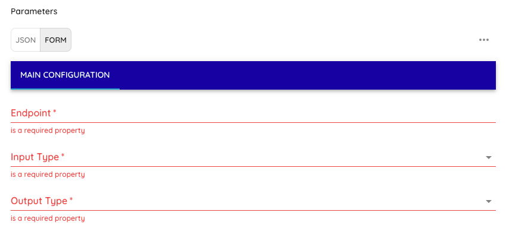
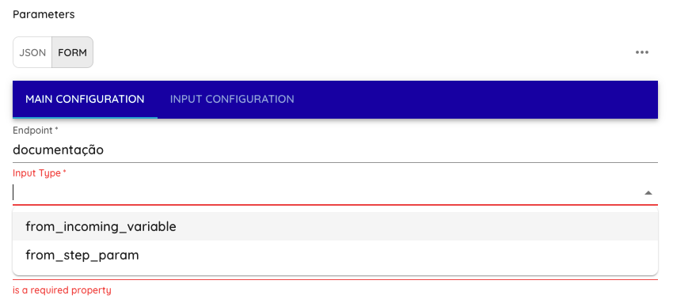
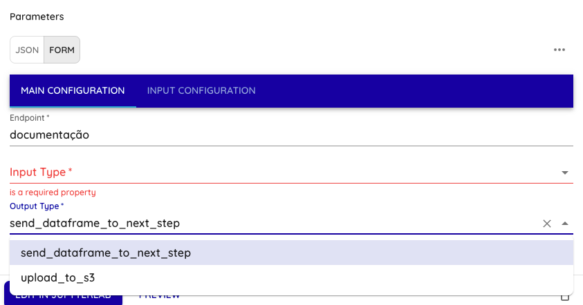
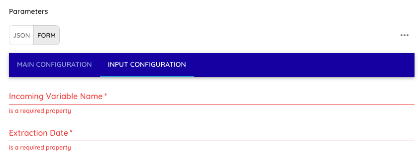
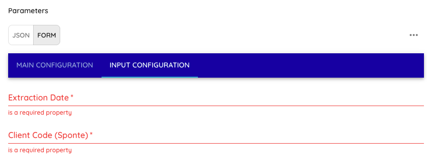
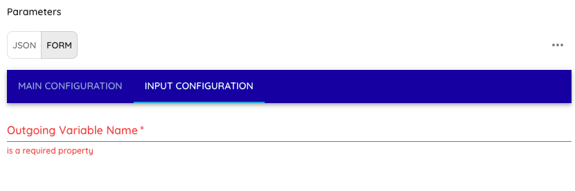
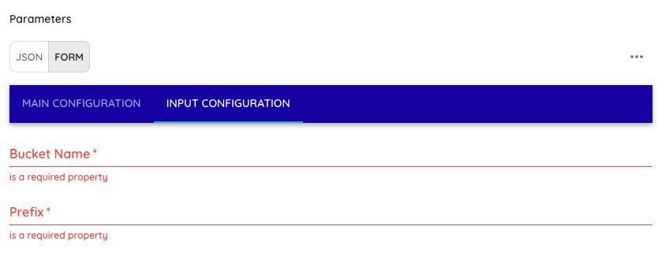

# Conector de dados - Sponte

Este passo (step) realiza a coleta de dados a partir da API da Sponte, respeitando a lógica de Full Load (quando não há histórico de execução) e Incremental (quando já existe um registro de data/hora de atualização).

## Step get_sponte_data

### Visão Geral
este conector interage com o endpoint:

```
    GET https://sponte-bi.sponteweb.com.br/api/v1/extracoes/{endpoint}
```

Respeitando:

- Limite de 1000 requisições por minuto, separados por todos os endpoints e fazendo o cálculo automático de máximo de requisições por step no módulo.
- Filtro incremental através da DataExtracao, que trás somente dados atualizados a partir de uma data da última requisição.
- O(s) código(s) do Cliente Sponte passados na configuração do step.
### Interação com os Códigos de Cliente Sponte

Os códigos de cliente Sponte (CodCliSponte) são a base para o funcionamento deste conector. Esses códigos identificam as entidades/organizações no sistema Sponte para as quais você deseja coletar dados. Cada requisição à API usa este código como parâmetro de filtro para retornar apenas os dados relacionados àquela entidade específica.

#### Como funciona:
1. **Identificação do cliente**: Cada código representa um cliente ou unidade organizacional no sistema Sponte.
2. **Filtragem de dados**: O código é usado na chamada da API como um parâmetro obrigatório para filtrar os dados.
3. **Múltiplos códigos**: É possível processar vários códigos em uma única execução, fornecendo-os separados por vírgula na configuração (ex: "123, 124, 125").
4. **Processamento sequencial**: O step percorre cada código do cliente e coleta todos os dados disponíveis antes de passar para o próximo código.

#### Exemplo prático:
Para uma rede de escolas com 3 unidades que possuem os códigos "123", "124" e "125" no sistema Sponte:
- Ao configurar `cod_cli_sponte: "123, 124, 125"`, o conector fará requisições separadas para cada código.
- Para cada código, o conector coletará todos os dados disponíveis (respeitando a paginação da API).
- Ao final, todos os dados de todos os códigos serão combinados antes do processamento final e da entrega do resultado.

Caso não exista histórico de execução (primeira vez), é feita uma carga completa (full load), coletando todos os registros disponíveis do endpoint a partir da "Data Extracao" informada no formulário do Step. Em execuções subsequentes, o script obtém apenas os registros que foram atualizados após a última data registrada.

### Arquivos e Variáveis Principais

- get_sponte_data.py: Arquivo Python com a lógica de coleta, onde ficam as funções:
    - get_last_update();
    - save_last_update();
    - find_max_updated_at();
    - fetch_data();
    - clean_data();
    - process_and_send_df_to_next_step();
    - process_and_upload_to_s3();
    - load_schema_from_file();
    - run().
- state/last_update_{endpoint}.json: Arquivo que armazena a última data/hora de atualização (formato ISO 8601 com Z no final). Se este arquivo não existir (ou estiver inválido), o script faz Full Load.
- schemas/schemas.json: Arquivo que armazena todos os schemas pré setados para todos as entidades(endpoints).

### Variáveis de Ambiente para configuração:

- api_key: x-api-key da conexão Sponte do cliente.

### Variáveis do step para configuração:
    
  - endpoint: Endpoint que irá ser extraído os dados

  - input_type: Tipo de input que o step irá receber, selecionar entre: from_incoming_variable ou from_step_param
    - se input_type = "from_incoming_variable"
        - incoming_variable_name: Adicionar nome da variável do step anterior
        - data_extracao: Adicionar a Data inicial que deseja fazer a extração dos dados no formato "YYYY-MM-DD", Exemplo de formato: "2025-01-01"
    - se input_type = "from_step_param"
        - cod_cli_sponte: Adicionar os códigos de clientes Sponte que vão ser extraídos. Pode ser 1 código ou vários, por exemplo: 123, 124, 125 (Se for mais de 1 código, separar por vírgulas)
        - data_extracao: Adicionar a Data inicial que deseja fazer a extração dos dados no formato "YYYY-MM-DD", Exemplo de formato: "2025-01-01"

  - output_type: Tipo de output que o step irá realizar, selecionar entre: send_dataframe_to_next_step ou upload_to_s3
    - se output_type = "send_dataframe_to_next_step"
        - outgoing_variable_name: Nome da variável que irá passar um DataFrame pandas para uma variável de saída do step.
    - se output_type = "upload_to_s3"
        - bucket_name: Bucket do S3 onde vão ser carregado os arquivos
        - prefix: prefixo de pastas onde vão ser carregado os arquivos dentro do bucket. Exemplo: "Sponte/incremental/endpoint"

### Exemplo de preenchimento dos paramêtros:
- Passo 1 (Aba Main Configuration):
    - Digitar o endpoint;
    - Selecionar o Input Type;
    - Selecionar o Output Type.

- Digitar o endpoint



- Selecionar o Input Type



- Selecionar o Output Type 



- Passo 2 (Aba Input Configuration):
    - se input_type = "from_incoming_variable"
        - Incoming Variable Name: Adicionar nome da variável do step anterior
        - Extraction Date: Adicionar a Data inicial que deseja fazer a extração dos dados no formato "YYYY-MM-DD", Exemplo de formato: "2025-01-01"


    - se input_type = "from_step_param"
        - Extraction Date: Adicionar a Data inicial que deseja fazer a extração dos dados no formato "YYYY-MM-DD", Exemplo de formato: "2025-01-01"
        - Client Code (Sponte): Adicionar os códigos de clientes Sponte que vão ser extraídos. Pode ser 1 código ou vários, por exemplo: 123, 124, 125 (Se for mais de 1 código, separar por vírgulas)


- Passo 3 (Aba Input Configuration):
    - se output_type = "send_dataframe_to_next_step"
        - Outgoing Variable Name: Nome da variável que irá passar um DataFrame pandas para uma variável de saída do step.


    - se output_type = "upload_to_s3"
        - Bucket Name: Bucket do S3 onde vão ser carregado os arquivos
        - Prefix: prefixo de pastas onde vão ser carregado os arquivos dentro do bucket. Exemplo: "Sponte/incremental/endpoint"



### Como Funciona o Fluxo

1. Verificação do Arquivo de Histórico (last_update.json)
- O script chama get_last_update() para verificar se existe uma data/hora salva.
    - Se não existir, considera `None` → Full Load a partir da data de extração fornecida no step.
    - Se existir (ex.: `"2024-12-27T10:46:28Z"`), o script usa esse valor → Incremental.
    
2. Coleta dos Dados (`fetch_data()`)

- Monta a requisição com parâmetros passados (DataExtracao e CodCliSponte)
- Executa requisições em loop até alcançar o total de registros informado pela API.
- Respeita o limite de 1000 requisições por minuto divididos entre todos os endpoints, realizando `time.sleep(60)` quando atinge esse valor.

3. Processamento e Salvamento

- Todos os dados são acumulados em `all_data`.
- O script converte a lista de dicionários e passa pela função `load_schema_from_file` para normalizar todos os schemas dos dados.
- Com os schemas padronizados, o conector verifica o dado que está no step param "output_type": 
    - se output_type = "upload_to_s3" - O Step salva um arquivo Parquet e grava no bucket S3 informado nas configurações do step.
    - se output_type = "send_dataframe_to_next_step" - O Step cria um dataframe a partir da lista de dicionários e passa essa lista como variável para um próximo step.

4. Atualização do `last_update`

- Ao final da coleta, o script chama `find_max_updated_at()` para descobrir a maior data/hora de atualização dos dados retornados.
- Se encontrar um valor (`DataExtracao`), ele é salvo em last_update_{endpoint}.json pela função `save_last_update()`.

5. Execução Futura

- Na próxima execução, a função `get_last_update()` encontra esse valor
    - o script busca apenas registros atualizados após esse timestamp, reduzindo a carga e tempo de processamento, realizando somente carga incremental.
    
### Como Executar

1. Instale Dependências

- Verifique se possui requests, json, time e outras bibliotecas padrão do Python 3.

2. Configure as Variáveis

- Ajuste os valores obrigatórios do step. Verifique as duas abas ("Main Configuration" e "Input Configuration")
- Defina o api_key válido na Sponte.
- Ajuste LAST_UPDATE_PATH, se desejar um caminho diferente (padrão: state/last_update_{endpoint}.json).

3. Rode o Script

- Na primeira execução, o script não encontrará state/last_update_{endpoint}.json e fará o full load a partir da DataExtracao fornecida.
- Ao final, criará (ou atualizará) o arquivo state/last_update_{endpoint}.json com o maior updated_at.
- Na segunda execução, fará o modo incremental (apenas dados atualizados após a data armazenada).

### Pontos de Atenção
1. Lista de Códigos Sponte

- Caso precise de uma lista de códigos da Sponte dinâmica, precisa informar a Dadosfera para desenvolvimento. Se precisar de códigos específicos, o step atende.

2. Número de Registros

- Caso existam muitos endpoints, o script pode demorar para terminar a carga inicial devido ao rate limit (1000 requisições por minuto dividos entre os endpoints).

3. Persistência

- Após obter os dados, você pode salvá-los em um caminho AWS S3 no formato Parquet ou passar os dados como Dataframe para um próximo step.

4. Erros e Exceções

- Se a API retornar erro (ex.: 401, 500), o script fará log do problema e a exceção será levantada.
- Em caso de problemas de rede ou timeouts, revise a lógica de retry/timeout no requests.get().